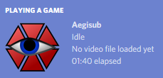
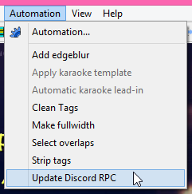
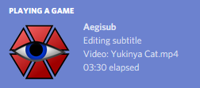

# Aegisub DiscordRPC
A Lua plugin (macro) for Aegisub to output currently editing
subtitle information to Discord Rich Presence

## Installation
### Windows
- Place the binary file `discord-rpc.dll` in your Aegisub installation folder.
  - If you use the discouraged 64-bit Aegisub then please take the
    provided `discord-rpc-64.dll` and rename it as `discord-rpc.dll` 
    before placing it in your Aegisub installation folder.
    - I don't guarantee if it would work in 64-bit Aegisub because I
      don't use them and I can't test it. Plus, the official website
      also discouraged the use of 64-bit release due to lack of support
      for most of its video tools and renderer)
- Place the script `discord-rpc.lua` into the `automation\autoload` folder.

#### Example
If you installed Aegisub in `C:\Program Files (x86)\Aegisub` then:
- Place `discord-rpc.dll` in `C:\Program Files (x86)\Aegisub`.
- Place `discord-rpc.lua` in
  `C:\Program Files (x86)\Aegisub\automation\autoload`.

### Mac
(Thanks to @NeSubs and @ilovedaehwi for assisting this in issue #1)
- Place the binary file `libdiscord-rpc.dylib` in `/usr/local/lib`.
  - If the directory `/usr/local/lib` does not exist, create it.
- Place the script `discord-rpc.lua` into the `automation/autoload` directory
  where you had installed Aegisub in.

### Linux (not tested)
(While I use Linux alongside Windows, I don't have Aegisub compiled/installed
natively where this would apply, so I can't test it. When running Aegisub on
Linux using WINE, the instruction for Windows should be used instead of this)
- Place the binary file `libdiscord-rpc.so` in `/usr/local/lib`.
  - If the directory `/usr/local/lib` does not exist, create it.
- Place the script `discord-rpc.lua` into the `automation/autoload` directory
  where you had installed Aegisub in.

## Usage
When installed correctly, it will first start the rich presense
with `Idle` as the detail and `No video file loaded yet` as the state
whenever you launched Aegisub.

Then, load your subtitle and video, and click on `Update Discord RPC`
from the `Automation` menu to let Aegisub update the Rich Presence
as `Editing subtitle` as the detail and the video file name as
the state.

### Warning
Please make sure that you have done either any of below before
clicking `Update Discord RPC` menu:
- You have already loaded the video for the subtitle you're editing.
- You have already loaded subtitle file containing video path.

This is because of limitation in Aegisub, it doesn't expose the
subtitle file name nor the window title to its Lua environment.
It does, however, expose the subtitle property metadata to the
Lua environment, and video path is one of the metadata in it.

I'm accessing that video path from the subtitle metadata for
display in Rich Presence, and it would not work if you did not
load any video for the subtitle file ever as the video path will
not be there in the subtitle metadata.

I initially planned to automatically load the video path when
Aegisub is launched, but it seems that the Lua script is loaded
*before* the subtitle metadata itself, which is why I had to
implement the "click on menu to update Discord RPC" method.

## References
### Script
This script uses some code from pfirsich's `lua-discordRPC`.
Visit [their repository](https://github.com/pfirsich/lua-discordRPC "pfirsich/lua-discordRPC on GitHub")
to learn more, especially if you want to use Discord Rich Presence in Lua.

Their script is licensed under MIT.

### Binary libraries
The binaries included in this repository came from Discord RPC
official releases. You can also download the binaries directly from
their [official repository](https://github.com/discordapp/discord-rpc/releases/latest "Latest Discord RPC release").

Make sure to take the dynamic version of binary:
- Take `discord-rpc/win32-dynamic/bin/discord-rpc.dll` from
  `discord-rpc-win.zip` for 32-bit Aegisub on Windows
- Take `discord-rpc/win64-dynamic/bin/discord-rpc.dll` from
  `discord-rpc-win.zip` for 64-bit Aegisub on Windows
- Take `discord-rpc/linux-dynamic/lib/libdiscord-rpc.so` from
  `discord-rpc-linux.zip` for Linux
- Take `discord-rpc/osx-dynamic/lib/libdiscord-rpc.dylib` from
  `discord-rpc-osx.zip` for Mac OS X

Their binaries and source code are licensed under MIT.

## License
- This project is released under
  [The MIT License](./LICENSE.txt "Read full license text").
- This project incorporated codes from
  [lua-discordRPC](https://github.com/pfirsich/lua-discordRPC) which is released
  under [The MIT License](./LICENSE.lua-discordRPC.txt "Read full license text").
- This project included the libraries from
  [discord-rpc](https://github.com/discordapp/discord-rpc) which is released
  under [The MIT License](./LICENSE.discord-rpc.txt "Read full license text").
